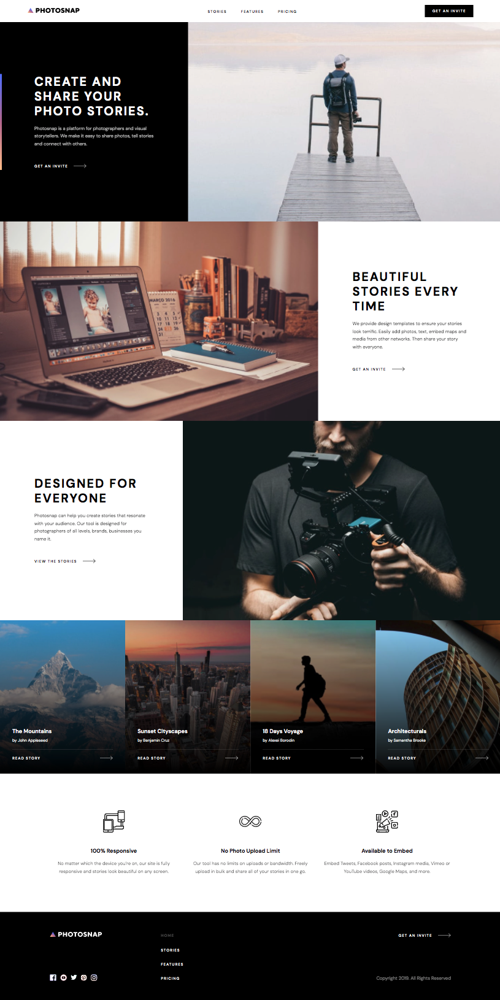

# Frontend Mentor - Photosnap Multipage Website

This is a solution to the [Photosnap Website challenge on Frontend Mentor](https://www.frontendmentor.io/challenges/photosnap-multipage-website-nMDSrNmNW). Frontend Mentor challenges help you improve your coding skills by building realistic projects.

## Table of contents

- [Overview](#overview)
  - [The challenge](#the-challenge)
  - [Screenshot](#screenshot)
  - [Links](#links)
- [My process](#my-process)
  - [Built with](#built-with)
  - [What I learned](#what-i-learned)
  - [Useful resources](#useful-resources)

## Overview

### The challenge

Users should be able to:

- View the optimal layout for each page depending on their device's screen size
- See hover states for all interactive elements throughout the site

### Screenshot

### Links

- Solution URL: [https://github.com/cjoak1028/photosnap-multi-page-website]
- Live Site URL: [https://photosnap-multi-page-website-theta.vercel.app/]

## My process

### Built with

- Semantic HTML5 markup
- SASS/SCSS
- Flexbox
- CSS Grid
- JavaScript ES6

### What I learned

The sole purpose of this project was for me to get more comfortable in using various existing tools to optimize layout and responsiveness. Through this, I've gained more awareness in which layout tool (Flexbox or CSS Grid) I had to use in certain circumstances.

### Useful resources

- [A Complete Guide to Flexbox](https://css-tricks.com/snippets/css/a-guide-to-flexbox/) - This helped me incorproate Flexbox into my project.
- [A Complete Guide to Grid](https://css-tricks.com/snippets/css/complete-guide-grid/) - This helped me incorporate Grids into my project.
